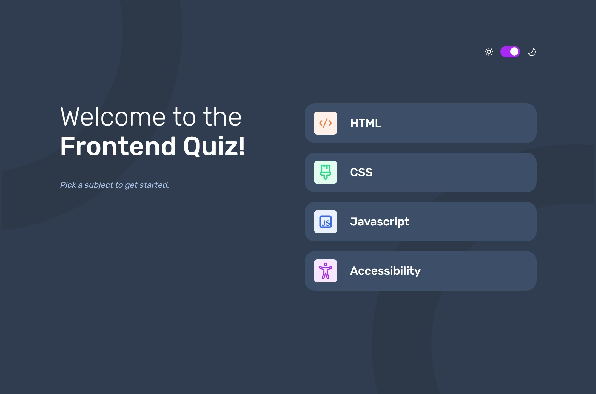

# Frontend Mentor - Frontend quiz app solution

This is a solution to the [Frontend quiz app challenge on Frontend Mentor](https://www.frontendmentor.io/challenges/frontend-quiz-app-BE7xkzXQnU). Frontend Mentor challenges help you improve your coding skills by building realistic projects.

## Table of contents

- [Frontend Mentor - Frontend quiz app solution](#frontend-mentor---frontend-quiz-app-solution)
  - [Table of contents](#table-of-contents)
  - [Overview](#overview)
    - [The challenge](#the-challenge)
    - [Screenshot](#screenshot)
    - [Links](#links)
    - [Built with](#built-with)
    - [What I learned](#what-i-learned)
      - [Keyboard navigation](#keyboard-navigation)
      - [Radix-UI](#radix-ui)
      - [React Recoil](#react-recoil)
    - [Continued development](#continued-development)
  - [Author](#author)

## Overview

### The challenge

Users should be able to:

- Select a quiz subject
- Select a single answer from each question from a choice of four
- See an error message when trying to submit an answer without making a selection
- See if they have made a correct or incorrect choice when they submit an answer
- Move on to the next question after seeing the question result
- See a completed state with the score after the final question
- Play again to choose another subject
- View the optimal layout for the interface depending on their device's screen size
- See hover and focus states for all interactive elements on the page
- Navigate the entire app only using their keyboard
- **Bonus**: Change the app's theme between light and dark

### Screenshot



### Links

- Solution URL: [(https://github.com/kamiliano1/frontend-quiz-app)](https://github.com/kamiliano1/frontend-quiz-app)
- Live Site URL: [https://frontend-quiz-app-alpha.vercel.app/](https://frontend-quiz-app-alpha.vercel.app/)

### Built with

- Semantic HTML5 markup
- CSS custom properties
- FlexBox
- CSS Grid
- Mobile-first workflow
- [React](https://reactjs.org/) - JS library
- [Next.js](https://nextjs.org/) - React framework
- [React Recoil](https://recoiljs.org/)
- [React hooks form](https://react-hook-form.com/)
- [radix-ui](https://www.radix-ui.com/)

### What I learned

#### Keyboard navigation

On this project I first tried to implement fully keyboard navigate. I am not sure if there is a better way to implement this feature.

```js
useEffect(() => {
  const submitKeyboard = (e: KeyboardEvent): void => {
    const key = e.key;
    if (key === "q")
      setGameStatus((prev) => ({ ...prev, isDarkMode: !prev.isDarkMode }));
  };
  window.addEventListener("keydown", submitKeyboard);
  return () => {
    window.removeEventListener("keydown", submitKeyboard);
  };
}, [setGameStatus]);
```

Keyboard navigation:

| Description                                            | Button |
| ------------------------------------------------------ | ------ |
| Toggle Dark / Light Mode                               | q      |
| Answer A / First category                              | a      |
| Answer B / Second category                             | b      |
| Answer C / Third category                              | c      |
| Answer D / Fourth category                             | d      |
| Process to the next question / Restart after quiz ends | Enter  |

#### Radix-UI

To improve accessibility:

- radix-ui/react-switch light and dark mode switcher
- radix-ui/react-progress progress bar
- radix-ui/react-radio-group radio input for the answers and category

#### React Recoil

To manage the state I've used

```js
gameStatusAtom.ts;
```

It keeps all the game status information.

```ts
subject: SubjectsType;
questionNumber: number;
isGameStarted: boolean;
isGameFinished: boolean;
userScore: number;
isDarkMode: boolean;
```

### Continued development

- Right now all questions and answers are in the same order every time you start the quiz. Further development might include reorder questions and answers.
- Increase the quantity of questions.
- Implement the timer, how long it takes to solve the quiz.

## Author

- Website - [Kamil Szymon](https://github.com/kamiliano1)
- Frontend Mentor - [@kamiliano1](https://www.frontendmentor.io/profile/kamiliano1)
